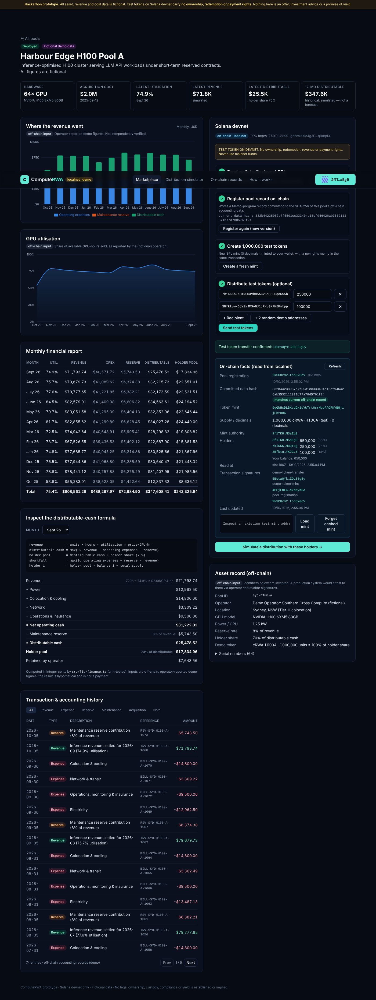
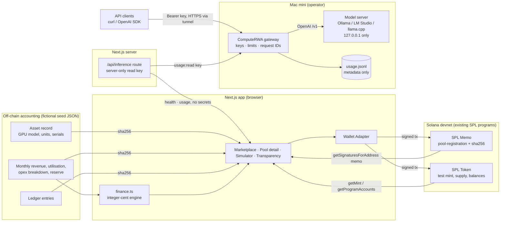

# ComputeRWA: hackathon prototype

**A transparency and financing layer for AI compute infrastructure.** Users can inspect GPU asset pools, read their (fictional) financial performance, mint and distribute **devnet test tokens** that stand for demo economic interests, and simulate how net cash flow would be allocated across token holders.

> ⚠️ **Prototype only.** All operators, assets, serial numbers, revenue and costs are **fictional** and have **not** been independently verified. Test tokens on Solana devnet carry **no ownership, redemption, revenue or payment rights**. Simulated allocations are not payments. Nothing here establishes legal ownership, custody, regulatory compliance or any yield, fixed or otherwise. The app refuses mainnet.



## Features

| Brief requirement | Where | Status |
|---|---|---|
| Marketplace of 3 seeded GPU pools (model, units, cost, status, utilisation, monthly revenue, fictional-data labels) | `/` | ✅ |
| Monthly revenue, opex, reserves, distributable cash; revenue and utilisation charts | `/pools/[id]` | ✅ |
| Transaction & accounting history (filterable, paginated ledger) | `/pools/[id]` | ✅ |
| Inspect the distributable-cash formula with each month's numbers substituted | `/pools/[id]` | ✅ |
| Connect a wallet on Solana devnet (Wallet Standard: Phantom, Solflare, Backpack…) | header | ✅ |
| On-chain pool registration record (SPL Memo with SHA-256 of the off-chain data) | pool page, step 2 | ✅ verified on a local validator |
| Create and distribute test SPL tokens, with a no-rights memo in every token transaction | pool page, steps 3–4 | ✅ verified on a local validator |
| Distribution simulator: revenue, opex, reserve, holder % → distributable cash and per-holder allocation | `/simulator` | ✅ |
| Per-holder allocations from **real on-chain balances** (or editable demo holders) | `/simulator` | ✅ |
| Unit tests for formulas and edge cases | `src/lib/*.test.ts` | ✅ |
| **Live inference:** authenticated OpenAI-compatible gateway for the Mac mini's Gemma 4 endpoint | `gateway/` | ✅ tested against a mock model server, **not yet against the real Mac mini** |
| Usage ledger: request ID, time, model, measured tokens/latency/status, estimated cost | `gateway/ledger.ts` | ✅ |
| Live inference dashboard: health, requests, latency, tokens, estimated cost, date range and source | `/inference` | ✅ |
| Simulator consumes live usage (actual revenue = $0) and a separately labelled hypothetical paid scenario | `/simulator` | ✅ |
| Transparency view separating on-chain facts from off-chain inputs (mint, supply, signatures, timestamps, hash check) | `/transparency`, pool page | ✅ |

## Quick start

```bash
cd computerwa
npm install
cp .env.example .env.local      # defaults to https://api.devnet.solana.com
npm run dev                     # http://localhost:3000
```

Use a wallet set to **devnet** (in Phantom: Settings → Developer settings → Testnet mode → Solana Devnet). Get devnet SOL from the in-app airdrop button or https://faucet.solana.com. The public devnet faucet is rate-limited, and the app shows a clear message when it is.

### Environment variables

| Variable | Default | Notes |
|---|---|---|
| `NEXT_PUBLIC_SOLANA_RPC` | `https://api.devnet.solana.com` | Any URL containing `mainnet` is rejected. A genesis-hash check also refuses mainnet at runtime. |
| `NEXT_PUBLIC_SOLANA_CLUSTER` | `devnet` | `devnet` or `localnet`. Used for labels and Solana Explorer links. |
| `NEXT_PUBLIC_ENABLE_BURNER_WALLET` | unset | `true` adds an in-memory throwaway "Burner Wallet" for demos and tests without a browser extension. Never enable it against anything holding value. |
| `INFERENCE_GATEWAY_URL` | unset | **Server-only.** URL of the inference gateway. Unset → `/inference` shows "Not configured". |
| `INFERENCE_GATEWAY_READ_KEY` | unset | **Server-only.** A gateway key with only the `usage:read` scope. Never prefix with `NEXT_PUBLIC_`. |

The gateway has its own settings in `gateway/.env.example`. See **[docs/live-inference.md](docs/live-inference.md)** for the Mac mini setup.

## Scripts

| Command | What it does |
|---|---|
| `npm run dev` / `build` / `start` | Next.js |
| `npm run typecheck` | `tsc --noEmit` |
| `npm run lint` | ESLint (`next/core-web-vitals`) |
| `npm test` | Vitest: finance engine, seed reconciliation, memo record parsing/hashing |
| `npm run seed` | Regenerates `src/data/pools.json` deterministically (seeded PRNG) |
| `npm run e2e:chain` | Node end-to-end run of the whole on-chain flow with a throwaway keypair (`SOLANA_RPC=…`) |
| `node scripts/e2e-ui.mjs <dir>` | Playwright browser run of the full UI flow (burner wallet + local validator), saving screenshots |
| `npm run gateway` | Starts the inference gateway (reads env; run on the Mac mini) |
| `npm run gateway:keys -- create <name> --scopes inference` | Creates an API key (printed once; only its SHA-256 is stored). Also `list` and `revoke <id>` |
| `npm run mock:model` | **Mock** OpenAI-compatible model server for testing without the Mac mini (not Gemma) |
| `npm run check:bundle` | After `build`, fails if the gateway URL, read key or model-server port appears in browser-delivered files |
| `node scripts/e2e-inference.mjs <dir>` | Playwright run of the live-inference dashboard and simulator, including the gateway-offline state |

## Architecture



**Design choices**

* **No custom program, no database; the only backend is one read-only API route for live inference.** Registration records use the SPL Memo program, and interests use plain SPL Token. Both are already deployed and audited, so nothing can fail to deploy during judging. Records are compact JSON tagged `"app":"ComputeRWA"` and are **rediscovered from chain** via `getSignaturesForAddress` (which returns memo text). Local storage only caches the last mint address.
* **Hash commitment.** The registration memo stores the SHA-256 of the pool's canonical off-chain record (`canonicalPoolRecord`). The UI recomputes the hash and shows *matches* or *changed since registration*. This proves the file hasn't changed since it was registered. It does **not** prove the figures are true.
* **Atomic mint.** One transaction creates the mint (0 decimals, mint authority = your wallet, no freeze authority), creates your associated token account, mints the pool's supply and writes the no-rights memo.
* **Signer-agnostic chain code.** `src/lib/solana/chain.ts` takes `{ publicKey, signTransaction }`, so the same functions run with a browser wallet and with a Node keypair in `scripts/chain-smoke-test.ts`. Transactions are sent through the app's own RPC connection, so they always go to the configured devnet endpoint.
* **Live inference without leaking secrets.** The browser only calls the app's own `/api/inference`. The gateway URL and read key live in server-side env vars, and `npm run check:bundle` verifies they are absent from browser bundles. The model server stays bound to `127.0.0.1`, and only the gateway is exposed (through a tunnel).
* **Usage is not revenue.** The gateway records no payments, so actual customer revenue is always $0. Measured values (requests, latency, runtime-reported tokens) and estimates (cost from configurable power, electricity and hardware assumptions) are stored in separate objects in every ledger entry. Requests without runtime token counts are excluded from token totals and never estimated.
* **Money in integer cents, balances in `bigint`.** Holder allocations use the largest-remainder method, so rows always sum exactly to the holder pool.

### Financial formula

```
revenue            = units × hours × utilisation × price per GPU-hour      (off-chain, reported)
net operating cash = revenue − operating expenses
distributable cash = max(0, revenue − operating expenses − reserve)
holder pool        = floor(distributable cash × holder share %)
retained           = distributable cash − holder pool
shortfall          = max(0, operating expenses + reserve − revenue)
holder allocation  = holder pool × balance ÷ total supply   (largest remainder; unheld supply → "unallocated")
```

The tests cover: the standard waterfall, losses and reserve-only shortfalls, break-even, zero revenue, 0% and 100% share, float drift (`0.3 − 0.1 − 0.1`), invalid inputs (negative, NaN, ∞, share outside 0–100), exact-sum rounding, tie-breaking, zero supply or no holders, unheld treasury supply, u64-scale balances, and seed-data reconciliation.

### File structure

```
computerwa/
├─ scripts/
│  ├─ generate-seed.ts        deterministic fictional data → src/data/pools.json
│  ├─ chain-smoke-test.ts     on-chain e2e (Node, throwaway keypair)
│  ├─ e2e-ui.mjs              browser e2e (Playwright, burner wallet)
│  ├─ e2e-inference.mjs       browser e2e of /inference + simulator (incl. offline)
│  ├─ mock-openai-server.mjs  MOCK model server for testing without the Mac mini
│  └─ check-bundle-secrets.mjs
├─ gateway/                   inference gateway (Node, zero runtime deps) — runs on the Mac mini
│  ├─ server.ts               routes, validation, limits, idempotency, structured errors
│  ├─ keys.ts / keys-cli.ts   hashed API keys + CLI
│  ├─ ledger.ts               append-only usage ledger + summaries
│  ├─ limits.ts / cost.ts / upstream.ts / config.ts / main.ts
│  └─ *.test.ts               unit + integration tests (mock upstream, offline, timeouts…)
├─ src/
│  ├─ app/                    /, /pools/[id], /simulator, /inference, /transparency, /about, /api/inference
│  ├─ components/             charts, ledger, formula inspector, on-chain panel, simulator
│  ├─ data/pools.json         seed data (FICTIONAL)
│  └─ lib/
│     ├─ finance.ts (+test)   distribution engine
│     ├─ pools.ts  (+test)    seed access & monthly summaries
│     ├─ solana/              config, chain ops, memo records (+test), React hooks, error mapping
│     └─ inference/           shared types, gateway client, accounting (+test), server-only loader
└─ docs/                      pitch deck, pitch script, demo scripts, screenshots
```

## Testing and verification

What was actually run while building this (October 2026):

1. `npm run typecheck`, `npm run lint`, `npm test` (66 tests: the original 34 plus 32 for the gateway and inference accounting) and `npm run build` all pass.
2. **On-chain flow against a real Solana validator.** The build container's network policy blocked `api.devnet.solana.com`, so both end-to-end runs used `solana-test-validator` (Agave 2.1.21), which runs the same SPL Token, Associated Token and Memo programs as devnet:
   * `SOLANA_RPC=http://127.0.0.1:8899 npm run e2e:chain` covers: genesis check → airdrop → register memo → atomic mint of 1,000,000 → transfer to 2 holders → read supply and 3 holders back from chain → rediscover all 3 records from signature history → allocate the holder pool using on-chain balances.
   * `scripts/e2e-ui.mjs` drives the **real UI** in Chromium with the burner wallet. It runs the same steps through the buttons, checks the hash badge says *matches*, checks the simulator picks up the on-chain balances, triggers a shortfall scenario and an input validation error, checks the transparency page, checks there is no horizontal scroll at 390px, and checks the 404 page.
3. **Live inference (gateway + dashboard), against a mock model server.** The real Mac mini and Gemma 4 were not reachable from the build environment, so a mock OpenAI-compatible server stood in for them.
   * The gateway integration tests start a real HTTP gateway in front of a mock upstream. They cover: success with measured tokens, a runtime without `usage` (tokens recorded as null), auth (missing, invalid, revoked, wrong scope), per-key rate limits, concurrency limits, body size limits, validation errors, Idempotency-Key de-duplication, upstream 500, invalid JSON, timeout, and **Mac mini offline** (`/healthz` 200, `/readyz` 503, chat 503 + Retry-After, recorded in the ledger at $0 estimated cost). They also check that a prompt and reply canary never reach the ledger or the logs.
   * A manual run with the real `npm run gateway` process, CLI-created keys and `curl` exercised: 200 with `x-request-id`, 409 on a retried Idempotency-Key, 401, 403, 413 and 429, plus a usage summary. The ledger file was checked for the prompt canary (0 matches).
   * `scripts/e2e-inference.mjs` ran in Chromium against the production build. It checked: dashboard *Online*, the request count incrementing after a live request, revenue $0.00, simulator live-actual revenue 0 and holder pool $0.00, the hypothetical label, the manual-edit flag, that the browser never contacted the gateway, then stopped the gateway and checked *API Offline* with no substituted data.
   * `npm run check:bundle` passed on a build configured with real gateway env values, and a negative control (a string known to be in the bundle) correctly failed.
4. **Not yet run from this environment:** the real Mac mini and Gemma 4 runtime, a public tunnel or Vercel deployment, a transaction on the public devnet cluster, and a Phantom/Solflare extension signing. The code path is identical (only the RPC URL changes, and extension wallets go through the same `signTransaction` interface), but run steps 1–4 below once on devnet before demoing.

No transaction signatures are included in this repo. Every signature the app shows is read live from the cluster you connect to.

## Repeatable demo scenario

1. Open `/`. Three fictional pools: the Sydney H100 pool (deployed, about 75% utilisation), the Melbourne L40S pool (deployed, more volatile) and the Brisbane B200 pool (commissioning, 3 months of history with low early margins).
2. Open **Harbour Edge H100 Pool A**. Walk through the revenue split chart, utilisation, monthly report, the **formula inspector** (pick Oct 25 to see a weak month) and the ledger.
3. Connect a devnet wallet → **Airdrop** → **Register pool** (the hash badge shows *matches*) → **Create test token** (1,000,000 units) → **+ 2 random demo addresses** → **Send test tokens**. Each step shows an Explorer link.
4. Click **Simulate a distribution**. Allocations come from on-chain balances (65 / 25 / 10%). Press **Stress: −40% revenue** twice to show the shortfall: nothing is distributable and every holder gets $0.
5. Open **On-chain records** to see on-chain facts next to off-chain inputs for every pool.
6. Optional tamper demo: change any number in `src/data/pools.json` and reload. The badge switches to *changed since registration*.

See `docs/demo-script.md` for a timed version.

## Deploying to Vercel

Add `INFERENCE_GATEWAY_URL` (the tunnel's HTTPS URL) and `INFERENCE_GATEWAY_READ_KEY` (a `usage:read` key) as **server** environment variables. Set the project root to `computerwa/`, keep the default Next.js preset, and set `NEXT_PUBLIC_SOLANA_RPC` (ideally a dedicated devnet RPC, such as Helius or QuickNode devnet, to avoid public rate limits). Do **not** set `NEXT_PUBLIC_ENABLE_BURNER_WALLET` on a public deployment unless it is clearly a test demo.

## Known limitations

* The data is fictional and static JSON; there is no operator or auditor attestation. Anyone can publish a registration memo for any pool ID, so the UI only shows records from the **connected wallet**.
* Holder discovery uses `getProgramAccounts`, which some RPC providers restrict. A dedicated devnet RPC avoids this.
* Burner-wallet keys are in-memory only and change on every reload.
* An Anchor registry program (PDA per pool, operator + auditor co-signing) is roadmap, not implemented.
* Live inference: see the limitations section of [docs/live-inference.md](docs/live-inference.md). In short: no streaming, tools or images; rate-limit state is in memory and single-process; a duplicate Idempotency-Key gets 409 (responses are not stored, so they cannot be replayed); token counts depend on the runtime; costs are estimates; the dashboard has no data while the Mac mini is offline.
